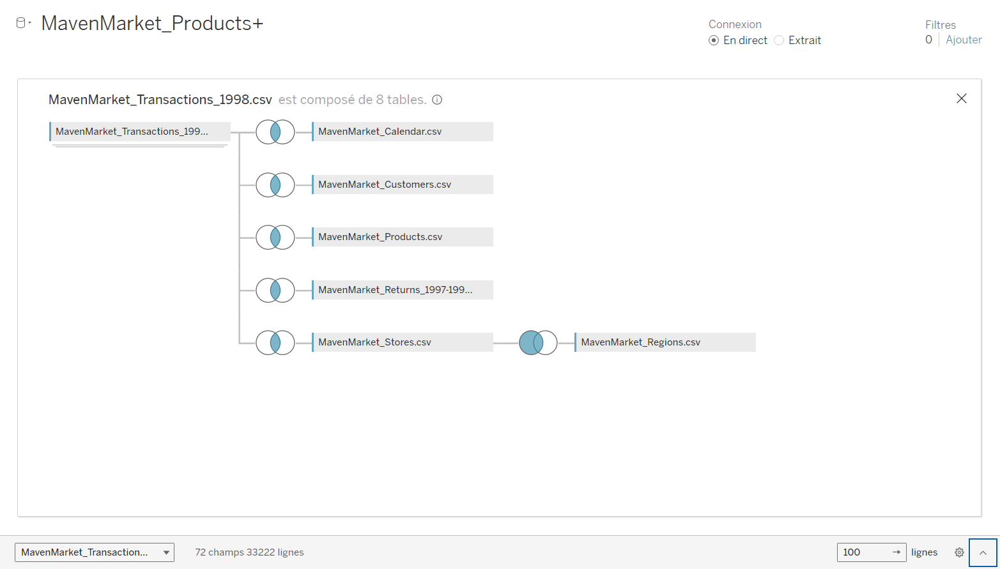

# Maven Market Sales Dashboard

## Description
The Maven Market Sales Dashboard is a dynamic and visually appealing tool designed to provide insights into sales performance for the year 1998. It enables stakeholders to monitor key metrics such as total sales, product quantities sold, profits, and customer transaction distributions. The dashboard was built using Tableau and integrates data from various sources for robust analysis.

## Features
- **Key Metrics Visualization**:
  - **Total Sales**: 151.5K
  - **Total Quantity of Products Sold**: 72K
  - **Total Profit**: 90K
  
- **Interactive Trends**:
  - Month-over-month comparisons of sales, product quantities, and profits.
  - Visual indicators to highlight performance changes compared to the previous year.

- **Top 15 Product Brands**: A bar chart showcasing the top-performing product brands based on sales.

- **Returned Products Analysis**:
  - Regional and district-level analysis of returned product quantities.
  - Bubble chart representation for better clarity.

- **Regional Sales Distribution**:
  - A pie chart displaying sales distribution across different regions, with notable performances in the North West and South West.

- **Geographical Transaction Mapping**:
  - Geographic visualization of customer transactions using a Mapbox map.

## Data Modeling
The dashboard integrates data from multiple tables using a star schema structure. Below are the data sources and their relationships:

- **Primary Data Source**:
  - `MavenMarket_Transactions_1998.csv`: Contains transactional data with 72 fields and over 33,000 rows.

- **Linked Tables**:
  - `MavenMarket_Calendar.csv`: Provides calendar-related information.
  - `MavenMarket_Customers.csv`: Stores customer details.
  - `MavenMarket_Products.csv`: Contains product metadata.
  - `MavenMarket_Returns_1997-1998.csv`: Tracks product returns.
  - `MavenMarket_Stores.csv`: Holds information about store locations.
  - `MavenMarket_Regions.csv`: Defines regional classifications.

## How to Use
1. Clone this repository to your local machine:
   ```bash
   git clone https://github.com/your-username/maven-market-dashboard.git
   ```

2. Open the Tableau file (`MavenMarketDashboard.twb`) to explore the dashboard.

3. Ensure all data files listed in the data modeling section are available and correctly linked in Tableau.

## Dependencies
- Tableau Desktop 2021.1 or newer.
- Data files in `.csv` format as listed in the data modeling section.

## Screenshots
### Dashboard Overview


### Data Model


## Author
[LAKNIN SAAD](https://github.com/Saad-Lk/)
